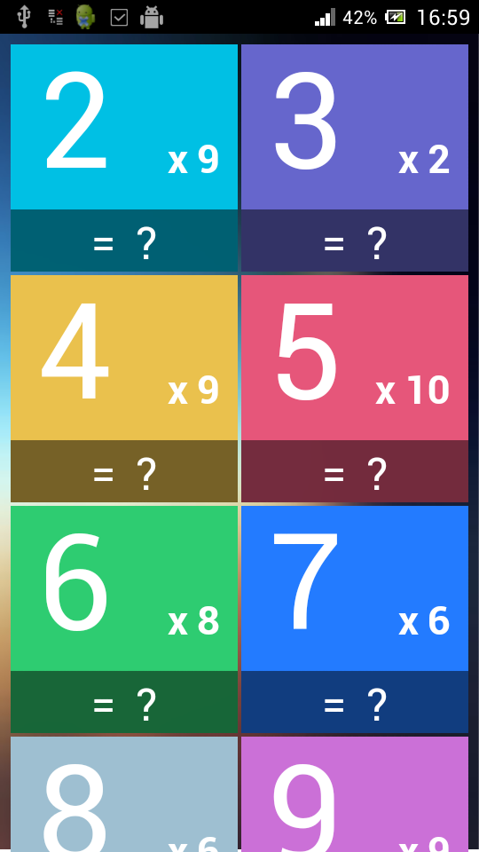

Multiplication Table App Demo
=================

PhoneGap multiplication table app. Run on web browsers and mobile devices.

*Believe it or not. The whole project on production is only `40.0KB` thanks to micro javascript frameworks [riotjs](https://github.com/moot/riotjs), [quojs](http://quojs.tapquo.com/).*

# Screenshot

#Run demo
You can run the project directly by opening the `www/build/index.html` file in the browser.

#Run on Web

In order to run project for development in web browser, you need:

1. Have [NodeJs](nodejs.org) installed
2. Have Grunt installed with cmd `npm install grunt-cli -g`
3. Have Bower installed with `npm install bower -g`
4. Navigate to the `www` folder of the project
6. `npm install` and `bower install` to install project's dependancies
7. `grunt dev` to run in development mode (coffee to js automation, livereload) or `grunt dist` to run in production mode with html, css, js minimized and all.

#Run as Android App

To run the project as an Android App is a bit more complex.

1. Have Java SDK/[JDK](http://www.oracle.com/technetwork/java/javase/downloads/jdk7-downloads-1880260.html) installed and added to environment PATH
2. Have [Ant](http://ant.apache.org/) installed and added to environment PATH
3. Have [adt](http://developer.android.com/sdk/installing/bundle.html) bundle install and both folder `sdk\platform-tools`, `sdk\tools` from the bundle added to environment PATH
4. Have [git](http://git-scm.com/) installed
5. Have cordova installed with `npm install cordova -g`
6. Either run an Android Emulator or plugin in your Android phone with USB debug enabled.
7. Navigate to the root folder of the project and execute cmd `cordova add android`
8. From now on, execute `cordova run android` every times you wish to deploy app to android device.
